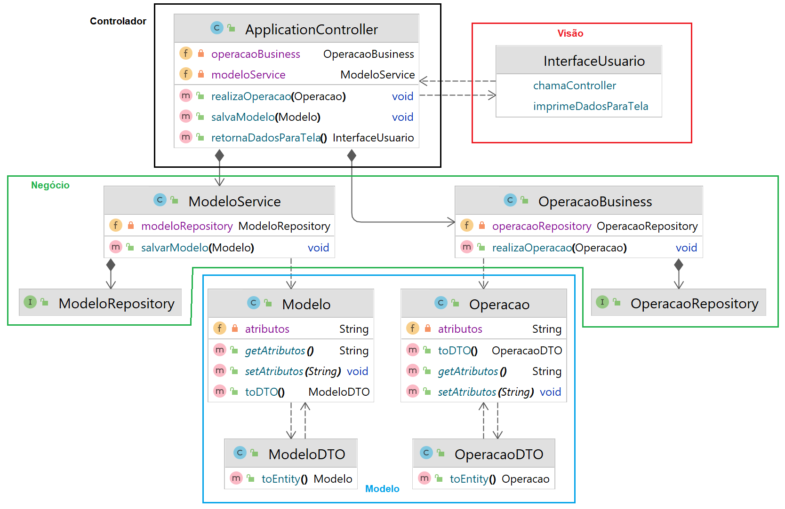
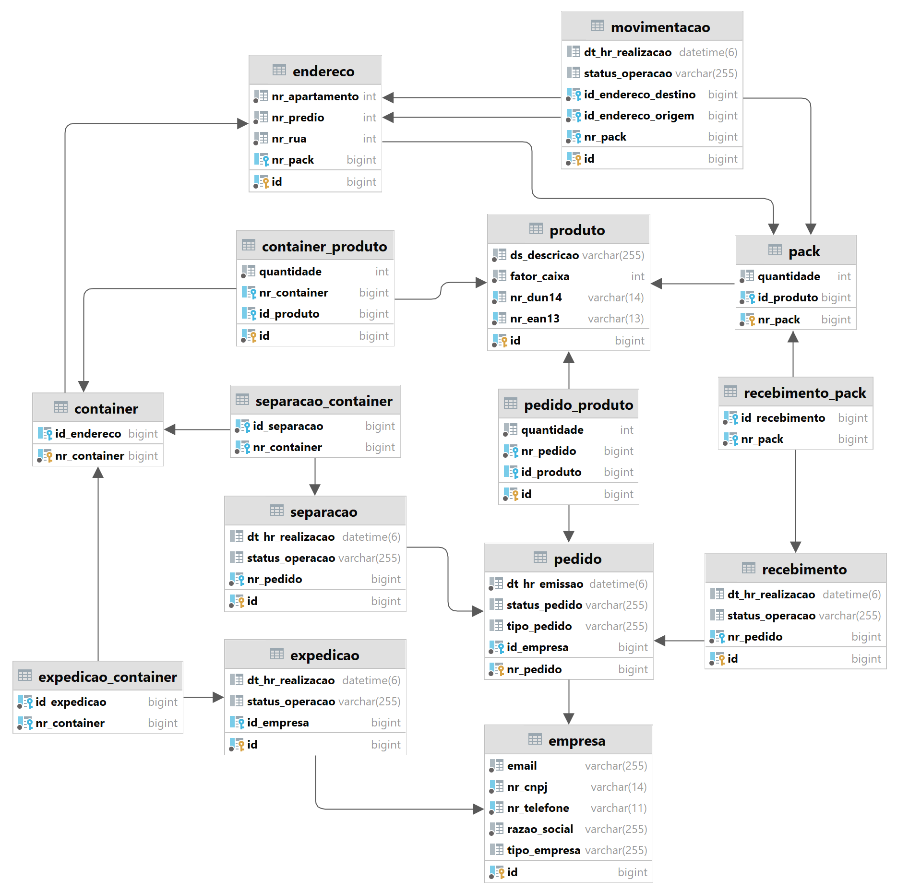

# LEONARD WMS v1.0
Sistema do tipo WMS (Warehouse Management System, ou [Sistema de Gerenciamento de Armazém](https://ilos.com.br/wms-no-gerenciamento-de-depositos-armazens-e-centros-de-distribuicao/)) capaz de monitorar e gerenciar as operações básicas de um centro de distribuição. 

## 💻 Sobre o projeto:
Projeto desenvolvido em ambiente acadêmico, cujo objetivo foi apresentá-lo como trabalho de conclusão de curso, no curso de graduação em Engenharia da Computação, na faculdade FEITEP. A monografia completa pode ser baixada [clicando aqui](assets/TCC-final.pdf).

## 👨‍💻 Desenvolvedor:
- [Allan Chavier Felintro](https://www.linkedin.com/in/allanfelintro/)

## 💾 Arquitetura:

Sua arquitetura geral foi construída inspirada no modelo [MVC (Modelo-Visão-Controlador)](https://www.treinaweb.com.br/blog/o-que-e-mvc), onde uma quarta camada, denominada Negócio, foi acrescentada na aplicação. Desta forma, obteve-se menor acoplamento e menor dependência entre as camadas do sistema.   

## 🛠️ Modelagem:

O banco de dados foi produzido em cima de parâmetros do sistema e das classes da camada Modelo, onde foi feito um mapeamento objeto-relacional com o recursos do conjunto [JPA-Hibernate](https://www.alura.com.br/apostila-java-web/uma-introducao-pratica-ao-jpa-com-hibernate) e do [Spring Data](https://www.zup.com.br/blog/spring-data-na-pratica), para então gerar as tabelas, seus atributos e seus identificadores.

## 🧰 Recursos do sistema:

* ### Básicos:
  * Cadastro de produtos;
  * Cadastro de empresas;
  * Cadastro de endereços;
  * Registro de pedidos;

* ### Operações logísticas:
  * Recebimento;
  * Armazenagem;
  * Movimentação;
  * Separação;
  * Expedição;

## ⚙️ Endpoints disponibilizados:

Um dos recursos do sistema é a criação de pedidos. Este processo é feito através de dois endpoints disponibilizados pela aplicação conforme mostra a tabela abaixo:

| Método HTTP | Endpoint                    | Descrição                       | Corpo da requisição             |
|-------------|-----------------------------|---------------------------------|---------------------------------|
| POST        | `/leonard/pedido/registrar` | Registra um novo pedido         | Dados do pedido em formato JSON |
| POST        | `/leonard/pedido/cancelar`  | Cancela um pedido pré-existente | Dados do pedido em formato JSON |

## 🛠️ Stack:

#### Back-end:

  
  
  

####  Front-end:

 
 
 

## 🚧 Propostas futuras (em construção):

* Implantação de autenticação de usuário;
* Implementação de permissões de acesso;
* Inclusão de validações de dados;
* Transição de textos hard-coded para dicionário gravado em arquivo .properties; 
* Implementação de relatórios;
* Melhoria na interface de usuário com a aplicação do CSS;
* Substituição do front-end de Thymeleaf para React ou Angular;
